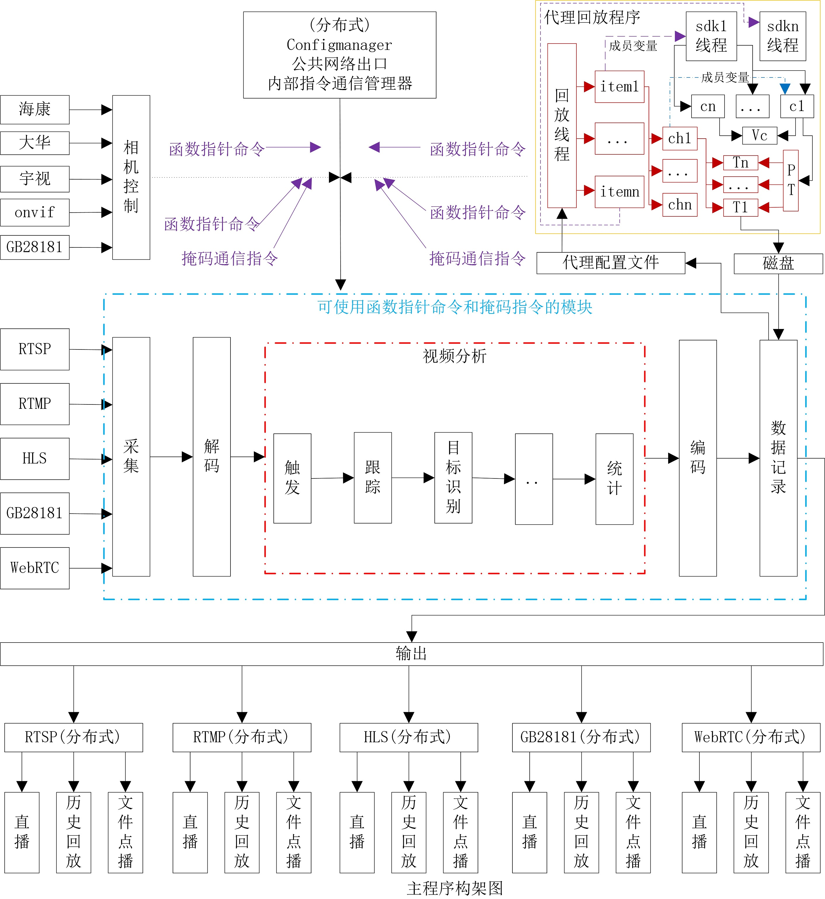

#### 项目地址
官网     http://www.feitianzhi.com/  
github  https://github.com/feitianzhi/zos-open    
gitee   https://gitee.com/feitianzhi/zos-open    
QQ交流群：[869598376](http://www.feitianzhi.com/ "zos分布式视频系统开发")
# fslib框架 #

- **fslib框架**是一套可运行于生产环境的支持c/c++线程死锁,线程cpu资源统计,死机时自动记录死机所对应的源码位置的调试框架,部分功能支持php语言；

- **fslib框架**内置了很多实用库    
>1. 配置库(FsConfig)--支持向上向下兼容的配置模块，同时可以导出与导入json和xml,可以参考 http://www.feitianzhi.com/boke/index.php/archives/47/    
>2. 端口代理--支持在一个端口上同时承载多种业务（比如rtsp,rtmp,http使用一个端口），一个业务分配多个端口（比如554和1554同时用作rtsp）
>3. xml、json库--用于xml同json互转，xml和json同FsConfig互转
>4. gb28181库--实现gb28181直播、回放、相机控制、上下级级联
>5. rstp库--实现rtsp拉流、推流、流分发、视频回放
>6. hls库--实现hls流分发，支持直播、回放
>7. rtmp库--实现rtsp拉流、推流、流分发
>8. 命令字算法--实现模块依赖解耦，在A模块需要调用B模块方法时允许A模块启动后再启动B模块
>9. 掩码通信算法--实现0和开关，在rtsp或rtmp需要分发流时调用此算法，任何一个模块需要流即会触发开关合上，所有模块都不需要流时即触发开关断开，在开关合上与断开时会调用预设的函数指针（比如rtsp拉流模块、rtmp拉流模块可以注册），以此实现汇总多个开启关闭信号，并隔离输出（可能是rtsp要流也可能是rtmp要流）与输入（可以是rtsp拉流接入也可以是rtmp拉流接入）

# ZOS视频系统 #

**ZOS视频系统**是用c语言开发的一套基于fslib框架的视频服务器应用,在有**fslib框架**强大的调试功能及基础库的保驾护航的条件下,**ZOS视频系统**致力为开发成为单进程的极高性能的综合视频应用,既是支持rtmp,rtsp,hls,gb28181采集,支持rtmp,rtsp,hls,gb28181直播,点播的流媒体服务器,也是一款支持rtmp,rtsp,hls,gb28181的NVR产品,还是一款视频分析系统!

## ZOS子模块 ##

ZOS子模块主要有：**ZOS去中心化的配置管理模块**、**ZOS掩码通信模块**(按需拉流,推流的核心)、**ZOS流媒体**、**ZOS NVR**、**ZOS水印叠加**、**ZOS视频分析**等多个模块，构成一套多功能的智能综合视频应用系统：

+ **ZOS去中心化的配置管理模块** 
所有服务器既是主服务器,也是从服务器,主从选举使用"比特币"的数据同步机制;
在去中心化的设计下,消灭了主节点与从节点的工程化区别,在配合系统配置自描述的向下兼容设计,让开发者及工程人员可渐进式学习,降低使用难度;
+ **ZOS掩码通信模块** 
>- 借鉴"面向对象编程"每个对象有独立的空间和方法,需要通信的每个对象拥有自己的空间和管理自己空间的方法(一个二进制位,和这个bit置0和置1的方法);
>- 借鉴"内存池的方式",在空间不够用时增加一个long long变量(64位,一个对象只需要1bit空间),优化内存分配,使用数字计算可用一个cpu指令计算64个对象的结果;
>- 参考"汇编优化"及计算机的特性--函数及变量均是一个地址,把通信实现为函数指针的直接调用,让一次通信的时间在纳秒级别;
>- 在极快且极轻量的**ZOS掩码通信模块**设计支撑下,程序内部可实现随意的多线程通信,且耗时与开销均可忽略不计,让复杂的**ZOS视频系统**的各种逻辑及接口都可蜕化成单线程串行构架(实质是并行运算),降低了实现单进程的极高性能的综合视频应用的开发成本;
+ **ZOS流媒体** 支持rtsp,rtmp,gb2818采集,rtsp,rtmp,hls,gb28181直播：
+ **ZOS NVR** 支持rtsp,rtmp,gb2818采集,mkv录像,按时间的rtsp点播,正向单帧,慢放,快放(最大1080P 32倍速),倒向单帧,慢放,快放(最大1080P 32倍速)；
+ **ZOS水印叠加** 支持rtsp,rtmp,gb2818采集,rtsp,rtmp,hls,gb28181直播视频上加水印输出；

## ZOS-open ##

**ZOS-open**是**ZOS视频系统**的开源版本,继承**fslib框架**、**ZOS去中心化的配置管理模块**、**ZOS掩码通信模块**的所有功能及特性；

+ **ZOS-open 编译**    
下载源码解压到Centos7下 如/opt/ZOS-open,执行以下命令编译
>- cd /opt/ZOS-open
>- make
>- 编译结果在/opt/dist/linux下,文件名为zos
+ **SOS-open 运行**    
&nbsp;&nbsp;&nbsp;&nbsp;&nbsp;&nbsp;在通用操作系统下运行
>- 拷贝编译的zos及hls.html、sysinfo.gz、xiaozhi.run到/fs/bin目录（这4个文件放在同一目录即可）
>- cd /fs/bin
>- ./xiaozhi.run
&nbsp;&nbsp;&nbsp;&nbsp;&nbsp;&nbsp;使用**小雉系统**的环境运行,参考 http://www.feitianzhi.com/boke/index.php/archives/11/ 搭建好**小雉系统**的环境运行,然后按如下操作进行;    
>- 停止服务器: systemctl stop os ;
>- 用u盘或ftp把编译的后的文件"zos"拷贝到测试机上替换"/fs/bin/zos" ;
>- 启动服务器: systemctl start zos ;
>- 运行 debug 输入zos前的的序号,查看zos的实时信息;
+ **ZOS-open 流地址规范**    
配置工具可参考：http://www.feitianzhi.com/boke/index.php/fslib-config.html    
如配置的rtsp转发地址为"/ch1",ip为 192.168.1.254,则转发地址如下:
>- rtsp转发地址为: rtsp://192.168.1.254/ch1 ;
>- rtmp转发地址为: rtmp://192.168.1.254/zos/ch1 ;
>- hls转发地址为: rtsp://192.168.1.254:16880/ch1 ;

# 获取更多信息 #

>- **ZOS视频系统**介绍: http://www.feitianzhi.com/boke/    
>- QQ交流群：[869598376](http://www.feitianzhi.com/ "zos分布式视频系统开发") 

